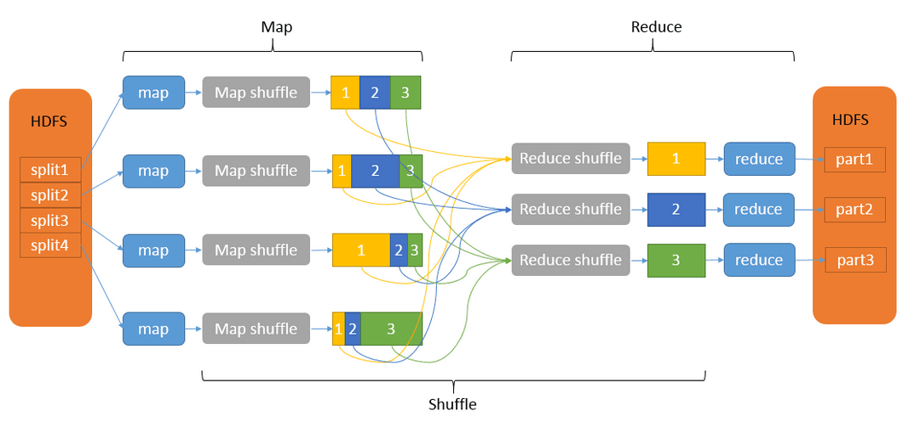
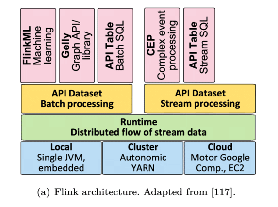

# 狂野大数据——大数据工程师体系笔记

Author:Munger·yang-杨桂淼&copy;

School:中国科学院大学/中国科学院 信息工程研究所 UCS_IIE

Address:北京市海淀区树村路19号

Tel:15803173971 | E-mail:jianghuxiaomiao666@163.com

下定决心 排除万难

立足专业 持之以恒

------

[TOC]

------

## 大数据工程师工作流程

- 数据采集——数据预处理——数据加载——数据分析/挖掘——数据导出——数据可视化

## 总结一些开发常用的基本指令

### 启动/关闭zookeeper集群

~~~shell
[root@node1 ~]# cd /export/onekey
[root@node1 onekey]# zk.sh start 
[root@node1 onekey]# zk.sh stop

#1.创建永久节点-不管终端是否关闭，节点永久存在
create /app1 hello
#2.创建永久顺序节点-在节点后面加上一串数字，数字越大表示节点创建的越晚
create -s /app2 world
#3.创建临时节点-节点随着客户端与服务器之间的会话存在而存在
create -e /tempnode world
#4.创建临时有序节点
create -s -e /tempnode2 aaa
#5.创建子节点-临时节点不能有子节点
create /app1/app11 hello11

#获取节点数据
get /app1
get /app1/app11

#修改节点数据
set /app1 hadoop

#删除节点
delete /app1(删除的节点不能有子节点)
rmr /app1
~~~

### 启动/关闭hadoop集群

~~~shell
#已经配置好环境变量，可以在任意位置进行集群的启动和关闭
[root@node1 ~]# start-all.sh
[root@node1 ~]# stop-all.sh

~~~

### 启动/关闭yarn集群

~~~shell
#已经配置好环境变量，可以在任意位置进行集群的启动和关闭
[root@node1 ~]# start-yarn.sh
[root@node1 ~]# stop-yarn.sh
~~~

### HDFS文件操作

~~~shell
#文件的上传
hadoop fs -put a.txt /dir
hsfs dfs -put a.txt /dir

#文件的下载
hadoop fs -get /dira/a.txt /root
hdfs dfs -get /dira/a.txt /root

#文件夹的创建
hadoop fs -mkdir -p /aaa/bbb/ccc
hdfs dfs -mkdir /aaa

#文件的删除
hadoop fs -rm /c.txt
#递归删除目录及目录里面内容
hadoop fs -rm -r /c.txt

#文件的复制
hadoop fs -cp /dir/1.txt /
hdfs dfs -cp /dir/1.txt

#文件的删除
hadoop fs -mv /dir/1.txt
hdfs dfs -mv /dir/1.txt

#权限设置
hadoop fs -chmod 777 /dira/a.txt
hdfs dfs -chmod 777 /dira/a.txt

#统计文件夹或者文件的大小信息
hadoop fs -du /dira
hdfs dfs -du /dira

#修改文件
hadoop fs -vi /app1/test1.java
hdfs dfs -vi /app1/test1.java

#设置副本数量
hadoop fs -setrep 10 /test/test2.java
hdfs dfs -setrep 10 /test/test2.java

#创建空文件夹
hadoop fs -touchz /name.txt
hdfs dfs -touchz /name.txt
~~~

## 大数据计算的发展历程

【温馨提示】

大数据主要侧重数据处理与分析，我们只是用Java来调用相关大数据的框架API

大数据中的分析，大部分都是通过SQL完成的，所以SQL语言需要重点掌握

大数据两种业务模式：

- OLTP-[数据库]联机事物处理(on-line transaction processing)
- OLAP-[数据仓库]联机分析处理(on-line analysis processing)

| 参数     | OLTP-联机事物处理              | OLAP联机分析处理                 |
| -------- | ------------------------------ | -------------------------------- |
| 目的     | 捕获存储交易数据以支持业务运营 | 获取业务见解、解决问题，支持决策 |
| 数据管理 | 传统的关系型数据库             | 数仓                             |
| 数据源   | 日常交易业务                   | 多源数据                         |
| 焦点     | 当下                           | 现在，未来预测                   |
| 任务     | 增删改查，过滤，排序           | 汇总和分析数据以支持决策         |
| 查询     | 简单                           | 复杂                             |
| 响应时间 | 毫秒                           | 秒、分钟、小时不定               |

### 计算模式-理解批处理和流处理

- 批量计算(batch computing):离线分析、历史数据分析-MapReduce、hive、Spark

- 流式计算(stream computing):实时计算,实时分析-Flink

- 图计算(graph computing):图形结构、网状结构的研究-pregel

批量计算、流式计算是目前业界主要的两种大数据计算模式。

### 第一代计算引擎-Hadoop/MapReduce

将计算阶段分为Map和Reduce两部分，对于应用而言，需要想方设法将作业拆分成map、reduce作业，以便完成整理算法。

Map是将大数据作业拆分成小文件分布到不同的服务器上，启动不同线程。Reduce是将拆分计算完成后的子任务合并为最终结果。

### 第二代计算引擎-TEZ

进一步优化了MapReduce的过程，TEZ把Map/Reduce过程拆分成若干子过程，同时可以把多个Map/Reduce任务组合成一个较大的DAG任务，减少了Map/Reduce之间的文件存储。

多个数据源，通过有**向无环图模式**进行拆分合并，最终得到**一个**计算结果。

### 第三代计算引擎-Spark

spark使用更先进的DAG(有向无环图)执行引擎，以支持循环数据流与内存计算，基于内存的执行速度要是MapReduce快上百倍，基于磁盘的速度也要快几十倍。

第三代计算引擎的出现，促进了上层应用的发展，各种迭代计算性能以及对流式计算和SQL的支持，目前已经发展出了良好的开发生态，大数据工程师必备技能。

### 第四代计算引擎-Flink

颠覆式的分布式计算引擎，主要表现在Flink对于流式计算的支持，以及性能的进一步提升。也支持batch与DAG运算。

离线计算分析和实时计算分析同时支持。流式计算处理数据的速度在秒级甚至是毫秒级。

### 流式计算

流式计算处理数据的速度在秒级甚至是毫秒级别。

流式计算/实时计算的主要工具是：spark、flink

数据生成[数据源]-实时采集[flume]-实时数据存储[Kafka]-(准)实时计算[spark/flink]-实时落地-实时展示[可视化成果]

实时计算应用场景：

1. 物流网：设备故障监控、实时监控、动态跟踪
2. 金融行业：欺诈检测，分析用户行为，识别可欺诈行为
3. 视频直播：个性化推荐、实时推荐
4. 电商行业：个性化精准推荐、实时报表、实时感知变化趋势